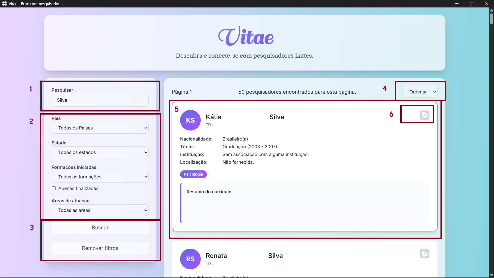

# Vitae's User Guide

This Guide covers the final user application for non-technical users on already setup environment.
If you need to use Vitae, but don't want to worry about instalations or command line interfaces, this is your go-to manual.

## Download

Download your application from the Github's Releases tab, this application is portable and does not need to be installed on your system.

You may notice some files on it, `vitae.exe` and `vitae.toml` are the ones you need to worry about to be able to run this.

## Setup Vitae.toml

The only parameters you need to update are those below, and your administrator must give you it. 

```toml
[postgres.user]
name = "database-user"          # Postgres User's name
password = "database-password"  # Postgres User's password

[postgres.database]
host = "127.0.0.1"              # Database's host, generally "127.0.0.1" or "0.0.0.0"
port = 5432                     # Database's port, generally "5432"
name = "vitae"                  # Database's name, your admin should use "vitae", preferably
```

Once this is setup, you don't need to change this anymore.

## Launching the Application

As any other desktop application, just double-click on `vitae.exe`, and then, it's working.
This may take 5s to 7s to open.

## Features



1. Search Bar: Enter the researcher’s name or ID
2. Filters: Filter by Country, State, Education, or Area
3. Submission: Perform the search
4. Sorting: Sort in alphabetical order
5. Profile: Click the profile to export it to Lucy Lattes
6. External Profile: Open the researcher’s profile on Lattes, or Orcid if available

There is also a button at the bottom of the page to request more researchers. A “go to top” button will appear on your right, and on the left, a button to go back to the previous page.

## FAQ

### Q: Why in Portuguese

This application was made for Brazilian users which speaks Portuguese natively. I honest don't expect English speaker users to be using this, but if there are any, let us know to add support for it.

### Q: Vitae keeps running even after closing it

For some reason when the window is closed the backend still runs on the compiled version of this application. If this still, just kill it from the Task Manager by searching for `vitae.exe`.