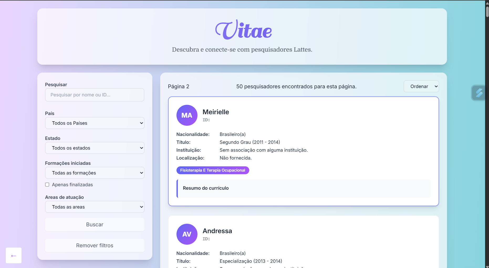

<h1 align="center">Vitae</h1>

<p align="center">
  

<p align="center">
  Vitae is a Search Engine for Lattes Researchers. 
  <br>
  This works by ingesting Lattes' XML files and storing them into a database. 
</p>
</p>

## At A Glance

With the built database, you can search for Researchers by name or ID and filters them by a lot of properties. This is also possible to export them to Lucy Lattes for graph creation or open their Curriculum on Orcid or Lattes itself.



<p align="center">User Application</p>

## Guide

### Non-Technical User

If you're already on a setted-up environment, with a running database, you may skip the [Environment Setup](#environment-setup) and read the [User Guide](./GUIDE.md) which covers the GUI Native-like application for non-technical users.

> [!INFO]
> Se você é um usuário brasileiro e está em um ambiente já configurado, por favor, leia: [Guia de Usuário](./GUIA.md).

### Administrator

If you need to setup your environment, read [Environment Setup](#environment-setup) and then the [User Guide](./GUIDE.md).

### Developer

If you're a developer and wants to contribute to the project, read the [Contributing](CONTRIBUTING.md) document after have read both [Environment Setup](#environment-setup) and [User Guide](./GUIDE.md).


## Environment Setup

### Requirements

This Python project is Poetry-based and this is required to have a deterministic environment and avoid dependency conflicts.

- [Python 3.12](https://www.python.org/)
- [PostgreSQL 17](https://www.postgresql.org/)
- [Python Poetry](https://python-poetry.org/)

## How to run it

### 1. Install Dependencies

```
$ poetry install
```

### 2. Setup vitae.toml


```bash
$ cp vitae.example.toml vitae.toml
# Now edit it to use your own settings
```

### 3. Activate Virtual Environment

```bash
$ poetry env activate
```

On *Visual Studio Code*: <kbd>Ctrl</kbd> + <kbd>Shift</kbd> + <kbd>P</kbd>,
then search for: *"Python: Select Interpreter"* and choose the one from Poetry's isolated environment.

### 4. Bootstrap

Before running the application for the first time, complete these steps:

1. **Create the Database**

Ensure your PostgreSQL database exists, using the same settings you specified in [Environment Settings](#2-environment-settings):

```bash
$ createdb <your-database> -U <your-user>
$ vitae bootstrap
```

2. **Add Your Curricula Repository**

Place your curricula repository in the root directory of this project (at the same level as the source code).

> [!WARNING]
> Add your curricula repository to `.gitignore` to avoid accidentally uploading it to remote.
> Also, remember to have the same name on your `vitae.toml` file.

3. **Directory Structure**

Your curricula's directory should look like this:

```text
root
|-- <curricula>   # Your curricula repository
|    |-- 00
|    |-- 01
|    |-- 02
|    +-- ...
|
|-- logs
|-- scripts
|-- tests
|-- vitae
|-- ...
```


### 5. Ingest XMLs Curriculum

```bash
$ vitae ingest
```

Remember to install with `poetry install` before run as a script.
Otherwise, you may run as `python -m vitae`.

### 6. Run Web UI

You may run the Web UI manually if you're a technical user and this brings some special functionalities, such as custom hosting, multiple workers or hot-reload, for development.

To run manually, you may use:

```
$ vitae web
```

By passing `--production`, you'll be hosting this on `0.0.0.0:8000` with 4 workers by default. Also, hot-reload is enabled by default for non-production runs.

If you want use your own custom settings, you may use:

```
$ uvicorn vitae.features.researchers.app:main
```

And pass your own flags, see [FastAPI](https://fastapi.tiangolo.com/)'s and [Uvicorn](https://www.uvicorn.org/)'s documentations for more details.

### 7. Explore

To know more about each detail of this project, just open `vitae` and read the documentation for each feature, which includes the objective and architectural decisions for each one.
The source code also provides documentation for crucial sections.

## Tooling Recomentation

1. **DBA tools**
  - [Beekeeper Studio](https://www.beekeeperstudio.io/) for SQL Queries. (Community ed. for Free)
  - [ChartDB](https://github.com/chartdb/chartdb) for Diagram visualization. (Self-hosted for free)
  - **pgAdmin 4**, general purpose. Comes with PostgreSQL. (Free)
2. **Python Linters, Formatters, Static Analysis**
  - [`ruff`](https://docs.astral.sh/ruff/) linter and code formatter. (lightweight alternative)
  - [`ty`](https://github.com/astral-sh/ty) Python type checking. (lightweight alternative)
  - [Pylance](https://marketplace.visualstudio.com/items?itemName=ms-python.vscode-pylance) VsCode's Extension
    as language server.